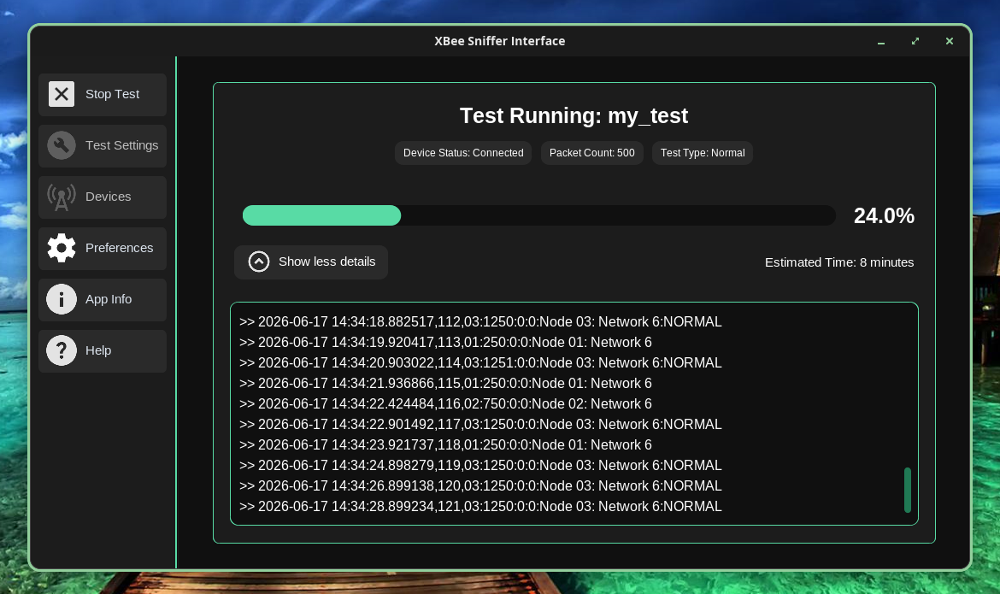

<p align="center">
  
</p>

# XBee Sniffer Interface
## Description
A GUI application used to read any packets in a given network using XBee radio modules. Originally desinged for the [C-ARQ research](https://github.com/a-pohlman/C-ARQ-Research) project at [Ohio Northern University](https://onu.edu), a lightweight and unique application that takes the hassle out of using a longwinded terminal script. With a easy to navigate user interface, it makes the process of starting and running new tests straightforward. 

<p align="center">
  
</p>

## Features
- Intuitive interface
- Better file management
- Easy configurations for testing
- Allows both .txt and .csv files
- Auto ends with specified string
- Auto ends with packet count (*New)
- Tracks progress during testing
- Supports different themes
- Has the ability to make custom tests (*New)
- Time Estimator (*New)

## Version 0.3.0
The current release of the application as of **06/25/2026.** This version of the application has had a major UI overhaul, completely changing how the app looks and feels. As well as this, other known features have had quality or bug fixes to them. 
> [!WARNING]
> The app was developed and tested using a Python 3.14 enviornment. If using the Python Version, and not an exectuable, it is recommended to have a Python interperter 3.10 and higher.

> [!IMPORTANT]
> The only XBee radio devices that were used to test on when developing the app were the XBee S2C radios. It may be possible that the app does not work with all XBee radio modules! If this happens please report this to the issues tab with your error.

## Setting Up
There are different ways to setup and run the application. Differenet versions of the application exsist, such as the Windows 11 version, or the Python version. Follow the steps below in order to install the version that you want!

### Windows 11 Version
1. Start by going to the releases tab on the right, and clicking on the version of XSI you want (available: XSI_0.2.5 | XSI_0.3.0)
2. Once downloaded, you should have a file called 'xsi_[VERSION]_setup.exe'
3. Double click or run the executable to start the setup wizard
4. Follow the on screen prompts
5. Wait for it to download

That's it! Assuming you checked the box for a desktop shortcut, you can now run the XSI application. 

### Python Version
1. Start by downloading the Github in whatever way you like (Whether it be the zip folder or cloning the repository)
2. Navigate to the folder you just downloaded
3. Extract the folder
4. Next, you'll need to install the correct modules for your Python interperter
   > NOTE: It's assumed that you already have a Python interperter downloaded if installing this verison. If you don't have one, download one before continuing forward.

   For the modules, go to your systems terminal, and type in the following command:
   ```powershell
   pip install customtkinter pyserial pillow
   ```
> [!TIP]   
> To check if the modules were installed correctly, in the same terminal type `python` and type the following code:
> ```python
> import customtkinter
> import serial
> import pillow
> ```

5. After verifying that the appropriate modules have been installed, navigate inside the folder you extracted from earlier
7. Navigate inside the bin folder
8. You'll find a file called 'xsi.pyw'
9. There are two options two running this file. If your in Windows, right click on it and slect Python. Otherwise, you can run the file using your systems terminal.

Assuming everything went correctly, you should have a working version of XSI using python!

### NOTES & WARNINGS DURING SETUP
> [!IMPORTANT]
> Inside the XSI_[VERSION] folder, you will also find a folder named 'cache.' When running tests with the 'default' path, this is where it will automatically store those files.

> [!WARNING]
> In its current state for the Windows 11, it is recommended not to store XSI in 'Program Files' folder as it has been known to crash and cannot save data in the default cache folder. Instead it is recommended to keep the program anywhere in the users files.

> [!CAUTION]
> It's important that you do not move any files or folders outside of the bin folder as this can and will cause the application to freeze and crash!

> [!CAUTION]
> Most Linux distributions tend NOT to have Tkinter / Tcl installed by default or built with python distributions. You'll have to install Tkinter manually for python on your own in order for the application to work on Linux based distributions. 

## Windows 11 Custom Test Issue
Recently, a new issue has been discovered regarding the 'xsi_custom_test.py' python file. If using the pre-compiled exectuable, but you want to make your own custom test, there has been a recent problem doing so. It's currently better to use the Python Version to actually utilize the custom test, but if you still want it bundled as one exectuable, then the best solution for this is by following the steps below to resolve this. 
1. Start by downloading the Python version of the application
2. Next, create and build your custom test that you want in the 'xsi_custom_test.py' file
3. Save the file
4. Download pyinstaller
> [!TIP]
> To download pyinstaller, use this command:
> ```powershell
> pip install pyinstaller
> ```
5. Navigate inside the bin folder with a terminal
6. Type: ```pyinstaller --icon "[PATH_TO_ICON]" xsi.pyw ```
7. This should give you several folders inside the bin folder now, navigate inside the 'dist' folder
8. Keep going inside these folders, until you find the exectuable.

This is where the newly built exectuable will live, and will be compiled with your new custom test. If you plan on moving the exectuable around the clean up the folders, you must move the exectuable with the '_internal' folder, and you must keep it within bin, as this is how the file structure has been setup up. 

> [NOTE]
> For future updates, this method will not be preferred and will be fixed to not have to recomplile a new version everytime you want to make a custom test! 

## Help
If you want to know how the app works, a PDF has been provided that will give all the knowledge needed on how to use the app. To access it, simply open the XSI application and click on the help button. This will open up the XSI Help document in the default browser.
> NOTE: You can also find it in XSI_[VERSION] > bin > tools folder either downloaded or in the Github repository. 
